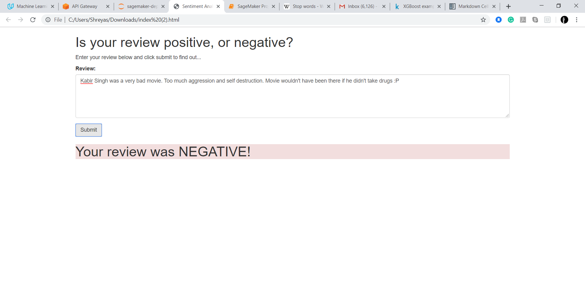
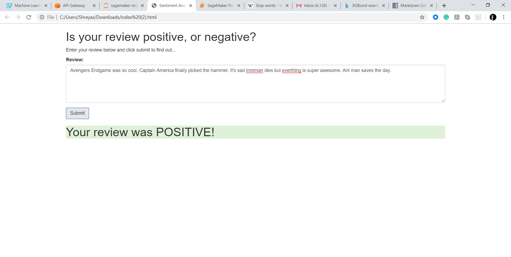

# Machine Learning Udacity Project
## Deploying RNN model for Sentiment Analysis 

### Requirements
  - [AWS Sagemaker](signin.aws.amazon.com/)
  - [Notebook instance on Sagemaker]
  - GPU insatnce - p2.xlarge in sage maker instance

### Data 
  - [IMDB database](http://ai.stanford.edu/~amaas/data/sentiment/)
  
### process
1.Download/Retrieve the data.
2.Process / Prepare the data.
3.Upload the processed data to S3.
4.Train a chosen model.
5.Test the trained model (typically using a batch transform job).
6.Deploy the trained model.
7.Use the deployed model using lambda function and API
  
### Output

